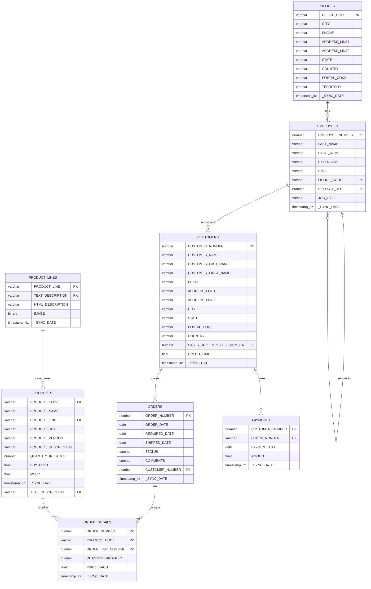
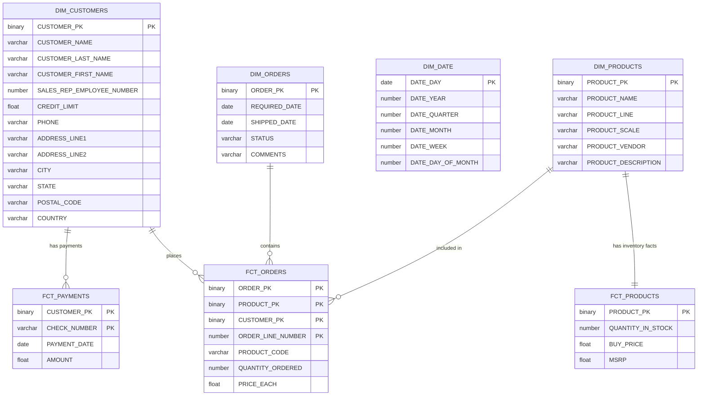

Welcome to our Dimensional Modeling Best Practices Project!

---

## Setup

### Prerequisites

Make sure the following tools are installed before continuing:

| Tool | Purpose | Install |
|------|---------|---------|
| dbt Cloud CLI | Local dbt development connected to dbt Cloud | [Install guide](https://docs.getdbt.com/docs/cloud/cloud-cli-installation) |
| Python ≥ 3.10 | Required by the Snowflake MCP server | [python.org](https://www.python.org/downloads/) |
| uv | Runs the Snowflake MCP server | `pip install uv` or `brew install uv` |
| pipx | Installs pre-commit in an isolated env | `pip install pipx` |
| pre-commit | Git hook runner for linting and checks | `pipx install pre-commit` |

> **dbt Cloud CLI vs dbt Core:** This project runs on **dbt Cloud** (project ID `554834`). Use the dbt Cloud CLI — not dbt Core — for local development. The Cloud CLI routes executions through dbt Cloud and automatically uses your cloud environment's connection.

---

### 1. Clone the repository

```bash
git clone <repo-url>
cd dbt-capstone-starter
```

---

### 2. Authenticate the dbt Cloud CLI

The dbt Cloud CLI reads connection credentials from `~/.dbt/profiles.yml`. Create or update it with your Snowflake connection:

```yaml
default:
  target: dev
  outputs:
    dev:
      type: snowflake
      account: <your-account-locator>       # e.g. PHDATAPARTNER-AWS
      user: <your-snowflake-username>
      role: <your-role>                     # e.g. USR_SEROJAS
      warehouse: <your-warehouse>           # e.g. ALL_DE
      database: sandbox
      schema: <your-schema>                 # e.g. JSROJAS (used as dev prefix)
      threads: 6
      authenticator: externalbrowser        # SSO via browser; or use snowflake + password
```

> The source data lives in `SANDBOX.CLASSIC_MODELS`. The `schema` value becomes the prefix for your dev schemas (e.g. `JSROJAS_STAGE`, `JSROJAS_INTERMEDIATE`, `JSROJAS_DATA_MART`).

---

### 3. Install dbt packages

```bash
dbt deps
```

This installs `dbt_project_evaluator` (declared in `packages.yml`) into `dbt_packages/`.

---

### 4. Verify your connection

```bash
dbt debug
```

All checks should pass before proceeding.

---

### 5. Set up pre-commit hooks

Pre-commit enforces SQL linting (sqlfluff), YAML formatting, and dbt model checks on every commit.

```bash
pre-commit install              # wire hooks into .git/hooks/pre-commit
pre-commit install --install-hooks   # pre-download all hook environments
```

To run all hooks manually against the full codebase:

```bash
pre-commit run --all-files
```

Hooks configured in `.pre-commit-config.yaml`:

| Hook | Purpose |
|------|---------|
| `trailing-whitespace`, `end-of-file-fixer`, `mixed-line-ending` | File hygiene |
| `check-yaml` | YAML syntax validation |
| `check-merge-conflict`, `check-added-large-files` | Safety checks |
| `sqlfluff-lint` / `sqlfluff-fix` | SQL style enforcement (Snowflake dialect) |
| `yamllint` | YAML formatting (max line length 120) |
| `dbt-parse` | Validates dbt project parses cleanly |
| `check-model-has-properties-file` | Every model must have a `.yml` companion |
| `check-model-has-description` | Every model must have a description |
| `check-model-name-contract` | Model names must start with `stg_`, `int_`, `dim_`, or `fct_` |
| `check-source-has-loader` | Every source must declare a `loader:` |
| `check-source-columns-have-desc` | Every source column must have a description |

---

### 6. Set up the Snowflake MCP server (Claude Code only)

The MCP server (`mcp/server.py`) lets Claude Code query Snowflake directly. It is registered in `.mcp.json` and runs via `uv`.

**Requirements:** `uv` must be installed (step 1) and `~/.dbt/profiles.yml` must be configured (step 2) — the server reads credentials from there at startup.

**Activation:** The server starts automatically when Claude Code loads the project. Reload the VS Code window after updating credentials:

- **VS Code:** `Cmd+Shift+P` → `Developer: Reload Window`
- **Terminal:** restart the `claude` process

**Verify connectivity** by asking Claude to run:

```
list_tables(schema=CLASSIC_MODELS)
```

You should see the 8 source tables returned.

---

### 7. Run the project

```bash
dbt build          # run + test all models
dbt docs generate && dbt docs serve   # browse the data catalog
```

---

### Resources

- [dbt docs](https://docs.getdbt.com/docs/introduction)
- [dbt Discourse](https://discourse.getdbt.com/)
- [dbt Community Slack](https://community.getdbt.com/)
- [dbt Blog](https://blog.getdbt.com/)
- [Classic Models dataset](https://relational.fel.cvut.cz/dataset/ClassicModels)

# Project Overview

This capstone project provides the opportunity to demonstrate and improve your skills/abilities with dbt. Within this capstone, you will be presented with a data source ERD and a final ERD of the expected data model. Along with a templated dbt project, this will help you get started developing your models.

**By the end of this Project, you will be able to:**
* Understand requirements.
* Transform a 3NF dataset into a Snowflake Schema.
* Build in dbt using best practices.
* Utilize packages, exposures, contracts, and the semantic layer.
* Create a dbt pipeline.

> **Let's begin the Project work!**

---

## Meet the Customer: Classic Car Components

At Classic Car Components, we understand that owning a vintage automobile is not just about transportation; it's about preserving a piece of history and reliving the golden era of motoring. Our passion for classic cars drives us to provide enthusiasts, restorers, and collectors with the highest quality parts and accessories needed to maintain and restore these timeless treasures.

### Classic Car Component's Heritage

Founded by a team of classic car aficionados, Classic Car Components has grown from a small workshop into a leading supplier of authentic and aftermarket parts for a wide range of classic makes and models. Our deep-rooted knowledge and appreciation for vintage vehicles set us apart in the industry, ensuring that every part we offer meets the highest standards of quality and authenticity.

### Classic Car Component's Products

We specialize in a comprehensive range of parts for classic cars, including:

* **Engine Components:** Pistons, crankshafts, gaskets, and more.
* **Body Parts:** Fenders, bumpers, mirrors, and trim pieces.
* **Electrical Systems:** Wiring harnesses, alternators, and ignition systems.
* **Interior Accessories:** Upholstery, dashboards, and steering wheels.
* **Suspension and Brakes:** Shocks, springs, and brake components.

Whether you're restoring a vintage roadster or maintaining a classic muscle car, we have the parts you need to ensure your vehicle runs smoothly and looks its best.

---

## Classic Car Component's Business Requirements

Our customer, Classic Car Components, primarily provides car parts for those who wish to rebuild their classic cars. While classic cars remain a popular hobby for many, it is rather expensive to run a business focused only on classic cars. Classic Car Components has reached out to phData to help them start to better understand their business.

The first use case will be focused on providing a utilitarian data model that can help the business report on their orders and transactions. However, the company would love to use the momentum of what is built to look into optimizing their warehouse usage by maintaining enough inventory on high-selling products.

Below you will find the ERD of the custom-built, in-house order processing system used at Classic Car Components:



To accomplish this, the team has decided to utilize dbt on top of Snowflake to create the starting place for a data model that will support reporting on a variety of needs across this data set. After some time meeting with the business and engineers, the Solution Architect returns with the following Snowflake data model:



To support the various transformations needed to support this data model, the Architect wants to build out a standard stage/intermediate/model architecture which looks like:

```text
├── models
│   ├── intermediate
│   │   ├── int_order_details.sql
│   │   ├── int_order_details.yml
│   │   ├── int_orders.sql
│   │   └── int_orders.yml
│   ├── marts
│   │   ├── dim_customers.sql
│   │   ├── dim_customers.yml
│   │   ├── dim_date.sql
│   │   ├── dim_date.yml
│   │   ├── dim_orders.sql
│   │   ├── dim_orders.yml
│   │   ├── dim_products.sql
│   │   ├── dim_products.yml
│   │   ├── fct_orders.sql
│   │   ├── fct_orders.yml
│   │   ├── fct_payments.sql
│   │   ├── fct_payments.yml
│   │   ├── fct_products.sql
│   │   └── fct_products.yml
│   └── staging
│       └── classic_models
│           ├── _classic_models__sources.yml
│           ├── stg_classic_models__customers.sql
│           ├── stg_classic_models__customers.yml
│           ├── stg_classic_models__employees.sql
│           ├── stg_classic_models__employees.yml
│           ├── stg_classic_models__offices.sql
│           ├── stg_classic_models__offices.yml
│           ├── stg_classic_models__order_details.sql
│           ├── stg_classic_models__order_details.yml
│           ├── stg_classic_models__orders.sql
│           ├── stg_classic_models__orders.yml
│           ├── stg_classic_models__payments.sql
│           ├── stg_classic_models__payments.yml
│           ├── stg_classic_models__product_lines.sql
│           ├── stg_classic_models__product_lines.yml
│           ├── stg_classic_models__products.sql
│           └── stg_classic_models__products.yml
```
