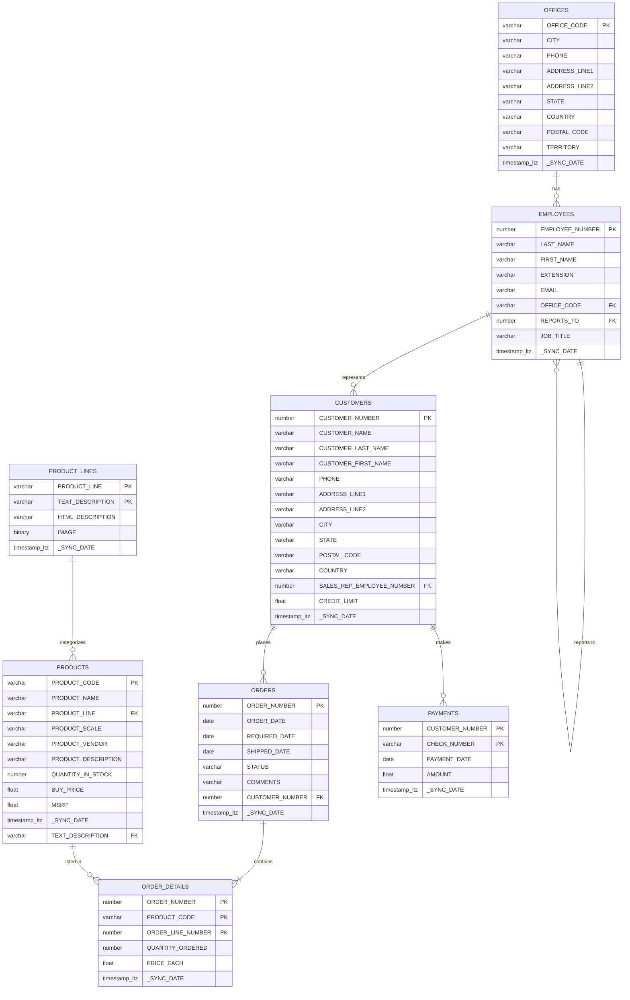
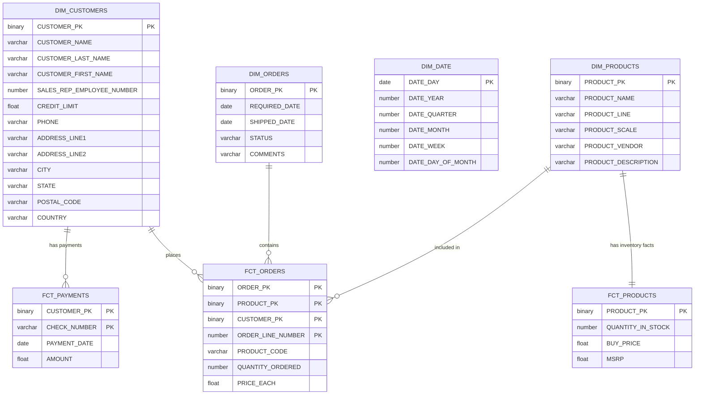

Welcome to our Dimensional Modeling Best Practices Project!

### Pre-Reqs for this project

This project makes use of a open data set found [here](https://relational.fit.cvut.cz/dataset/ClassicModels). This data set will need to be configured as the source for this project to run. You will also want to configure your Database and Schemas that you want this to run into in the dbt_project.yml file.

Once configuration has been complete you can run the project using:
- dbt build


### Resources:
- Learn more about dbt [in the docs](https://docs.getdbt.com/docs/introduction)
- Check out [Discourse](https://discourse.getdbt.com/) for commonly asked questions and answers
- Join the [chat](https://community.getdbt.com/) on Slack for live discussions and support
- Check out [the blog](https://blog.getdbt.com/) for the latest news on dbt's development and best practices

# Project Overview

This capstone project provides the opportunity to demonstrate and improve your skills/abilities with dbt. Within this capstone, you will be presented with a data source ERD and a final ERD of the expected data model. Along with a templated dbt project, this will help you get started developing your models.

**By the end of this Project, you will be able to:**
* Understand requirements.
* Transform a 3NF dataset into a Snowflake Schema.
* Build in dbt using best practices.
* Utilize packages, exposures, contracts, and the semantic layer.
* Create a dbt pipeline.

> **Let's begin the Project work!**

---

## Meet the Customer: Classic Car Components

At Classic Car Components, we understand that owning a vintage automobile is not just about transportation; it's about preserving a piece of history and reliving the golden era of motoring. Our passion for classic cars drives us to provide enthusiasts, restorers, and collectors with the highest quality parts and accessories needed to maintain and restore these timeless treasures.

### Classic Car Component's Heritage

Founded by a team of classic car aficionados, Classic Car Components has grown from a small workshop into a leading supplier of authentic and aftermarket parts for a wide range of classic makes and models. Our deep-rooted knowledge and appreciation for vintage vehicles set us apart in the industry, ensuring that every part we offer meets the highest standards of quality and authenticity.

### Classic Car Component's Products

We specialize in a comprehensive range of parts for classic cars, including:

* **Engine Components:** Pistons, crankshafts, gaskets, and more.
* **Body Parts:** Fenders, bumpers, mirrors, and trim pieces.
* **Electrical Systems:** Wiring harnesses, alternators, and ignition systems.
* **Interior Accessories:** Upholstery, dashboards, and steering wheels.
* **Suspension and Brakes:** Shocks, springs, and brake components.

Whether you're restoring a vintage roadster or maintaining a classic muscle car, we have the parts you need to ensure your vehicle runs smoothly and looks its best.

---

## Classic Car Component's Business Requirements

Our customer, Classic Car Components, primarily provides car parts for those who wish to rebuild their classic cars. While classic cars remain a popular hobby for many, it is rather expensive to run a business focused only on classic cars. Classic Car Components has reached out to phData to help them start to better understand their business. 

The first use case will be focused on providing a utilitarian data model that can help the business report on their orders and transactions. However, the company would love to use the momentum of what is built to look into optimizing their warehouse usage by maintaining enough inventory on high-selling products.

Below you will find the ERD of the custom-built, in-house order processing system used at Classic Car Components:



To accomplish this, the team has decided to utilize dbt on top of Snowflake to create the starting place for a data model that will support reporting on a variety of needs across this data set. After some time meeting with the business and engineers, the Solution Architect returns with the following Snowflake data model:



To support the various transformations needed to support this data model, the Architect wants to build out a standard stage/intermediate/model architecture which looks like:

```text
├── models
│   ├── intermediate
│   │   ├── int_order_details.sql
│   │   ├── int_order_details.yml
│   │   ├── int_orders.sql
│   │   └── int_orders.yml
│   ├── marts
│   │   ├── dim_orders.sql
│   │   ├── dim_orders.yml
│   │   ├── fct_orders.sql
│   │   └── fct_orders.yml
│   └── staging
│       └── classic_models
│           ├── _classic_models__sources.yml
│           ├── stg_classic_models__orders.sql
│           ├── stg_classic_models__orders.yml
│           ├── stg_classic_models__order_details.sql
│           ├── stg_classic_models__order_details.yml
│           ├── stg_classic_models__customers.sql
│           └── stg_classic_models__customers.yml
```
