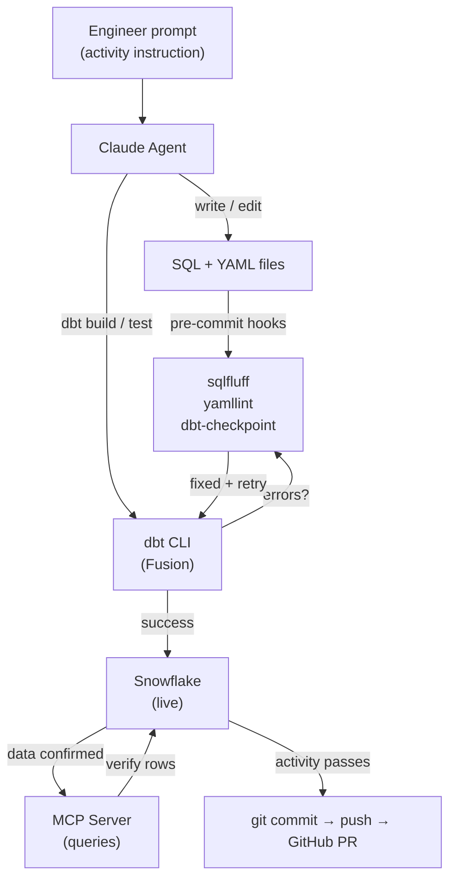
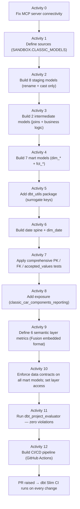
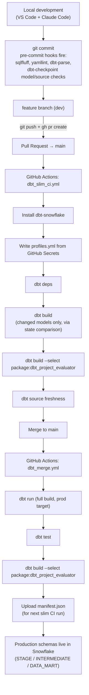
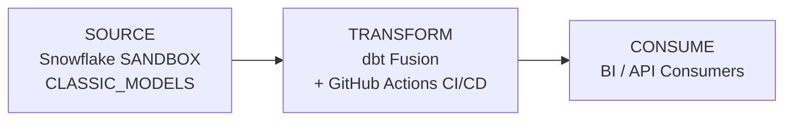
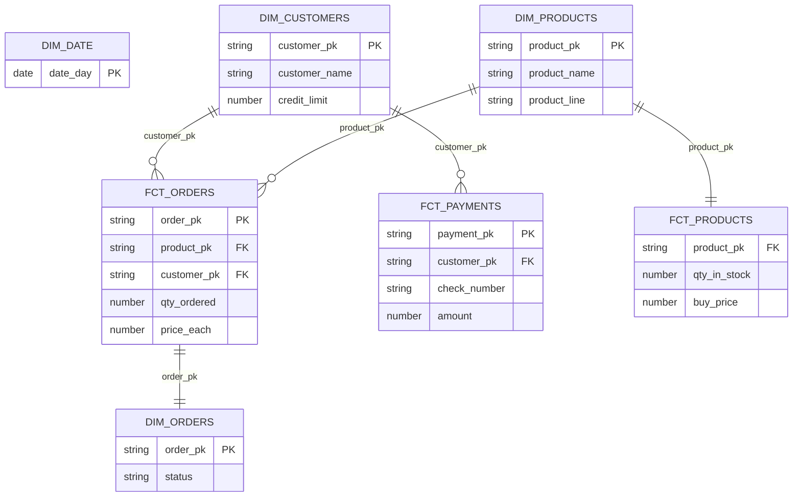

# Architecture Overview — Classic Car Components dbt Capstone

---

## Part 1 — AI-Assisted Development Workflow

### The Core Loop

This project was built entirely through an AI-assisted development cycle using **Claude Code** (Anthropic's CLI agent) operating inside VS Code. Rather than manually writing SQL and YAML, the engineer directed Claude through a structured checklist of 12 activities, with Claude executing each one end-to-end: writing code, running dbt, inspecting results in Snowflake, linting, committing, and iterating on errors.



---

### Tools and Capabilities Available to Claude

Claude Code had access to four categories of tooling simultaneously, making it a fully autonomous analytics-engineering agent:

#### 1. File System Tools
Direct read/write/edit access to all project files. Claude wrote every SQL model, YAML schema file, macro, and configuration without manual copy-paste.

#### 2. Bash / CLI Tools
Claude ran shell commands directly in the terminal:

| Command class | Purpose |
|---------------|---------|
| `dbt build --select <model>` | Compile, run, and test a model in one step |
| `dbt compile --write-catalog` | Generate the catalog for pre-commit hooks |
| `dbt ls --select exposure:<name>` | Verify exposures, metrics, and semantic models |
| `pre-commit run --all-files` | Enforce SQL/YAML linting before commit |
| `git commit / push / gh pr create` | Full GitHub workflow without leaving the agent |
| `sqlfluff lint / fix` | Auto-correct SQL style violations |

#### 3. Snowflake MCP Server
A custom Python MCP server (`mcp/server.py`) gave Claude live read-only access to the Snowflake warehouse via the Model Context Protocol. This meant Claude never guessed at column names, data types, or row counts — it checked.

| MCP Tool | How Claude used it |
|----------|--------------------|
| `list_schemas(database)` | Confirmed `SANDBOX.CLASSIC_MODELS` existed before writing sources |
| `list_tables(schema)` | Enumerated all 8 source tables before writing staging models |
| `describe_table(table, schema)` | Inspected column names and types before casting in SQL |
| `execute_query(sql)` | Profiled data (nulls, cardinality, value ranges) mid-build |
| `preview_dbt_model(model_name)` | Verified every materialized model had rows after `dbt build` |

#### 4. dbt Skill Plugins
Claude loaded specialized dbt agent skills from a plugin marketplace, providing structured guidance beyond generic coding:

| Skill | Applied to |
|-------|-----------|
| `using-dbt-for-analytics-engineering` | Model building, staging patterns, CTE conventions |
| `running-dbt-commands` | Selector syntax, `--quiet` flags, `dbt show` for validation |
| `troubleshooting-dbt-job-errors` | CI failure diagnosis — credential errors, schema mismatches |
| `building-dbt-semantic-layer` | Embedded `semantic_model:` + `metrics:` YAML format |

---

### How Claude Learned From Errors

Each activity followed an automated error-recovery loop. When a step failed, Claude read the error, diagnosed the root cause, applied a fix, and retried — without requiring the engineer to intervene. Key examples:

#### Error Type 1 — Fusion YAML Validation
```
DbtYamlValidationError: Deprecated test arguments detected.
Please migrate to the new format under the arguments field.
```
**Root cause:** dbt Fusion requires all generic test arguments nested under `arguments:` (not bare keys like `values: [...]`).
**Fix applied:** Claude rewrote all affected test blocks across every YAML file and added the pattern to `CLAUDE.md` to prevent recurrence.

#### Error Type 2 — Schema Mismatch
```
Models land in JROJAS instead of JROJAS_STAGE / JROJAS_DATA_MART
```
**Root cause:** The `models:` key in `dbt_project.yml` must exactly match the project `name:` field (`dim_model`). A wrong key silently breaks all layer schema routing.
**Fix applied:** Corrected the key and documented the gotcha.

#### Error Type 3 — MCP Connectivity
```
Connection error: placeholder credentials in profiles.yml
```
**Root cause:** A project-level `profiles.yml` template (gitignored) was overriding `~/.dbt/profiles.yml`. The `DBT_PROFILES_DIR` env var in `.mcp.json` pointed to the project directory.
**Fix applied:** Removed `DBT_PROFILES_DIR` from `.mcp.json`; deleted the template file so dbt fell back to the user's real credentials.

#### Error Type 4 — CI Credentials
```
Runtime Error: Credentials in profile "default", target "ci" invalid: None is not of type 'string'
```
**Root cause:** GitHub repository secrets (`SNOWFLAKE_ACCOUNT`, `SNOWFLAKE_USER`, etc.) were not yet configured. Local auth uses SSO (`externalbrowser`), which is headless-incompatible.
**Fix:** Configure GitHub Actions secrets with password-based Snowflake credentials.

---

### Activity Progression — From Blank Repo to Production-Ready Pipeline



Each activity ended with: `dbt build` passes → `preview_dbt_model` confirms rows → `git commit` → next activity.

---

### Git and GitHub Workflow



---

## Part 2 — Tech Stack Architecture

### Component Map



---

### Snowflake — Data Warehouse

```mermaid
flowchart TD
    DB["SANDBOX (database)"]

    DB --> SRC["CLASSIC_MODELS\nsource schema — raw 3NF data"]
    SRC --> T1[CUSTOMERS]
    SRC --> T2[EMPLOYEES]
    SRC --> T3[OFFICES]
    SRC --> T4[ORDERS]
    SRC --> T5[ORDER_DETAILS]
    SRC --> T6[PAYMENTS]
    SRC --> T7[PRODUCTS]
    SRC --> T8[PRODUCT_LINES]

    DB --> STG["JSROJAS_STAGE (dev) / STAGE (prod)"]
    STG --> S1["9 staging views\n(1:1 with source tables + date spine)"]

    DB --> INT["JSROJAS_INTERMEDIATE (dev) / INTERMEDIATE (prod)"]
    INT --> I1["2 intermediate tables\n(joined / enriched sets)"]

    DB --> DM["JSROJAS_DATA_MART (dev) / DATA_MART (prod)"]
    DM --> M1["dim_customers — public, contract enforced"]
    DM --> M2["dim_orders — public, contract enforced"]
    DM --> M3["dim_products — public, contract enforced"]
    DM --> M4["dim_date — public, contract enforced"]
    DM --> M5["fct_orders — public, contract enforced"]
    DM --> M6["fct_payments — public, contract enforced"]
    DM --> M7["fct_products — public, contract enforced"]

    DB --> EVL["DBT_PROJECT_EVALUATOR\n(quality gate results)"]
```



**Schema routing** is handled by the `generate_schema_name` macro:
- Dev → `<user_schema>_<layer>` (e.g., `JSROJAS_STAGE`)
- CI / Prod → `<layer>` directly (e.g., `STAGE`)

---

### dbt — Transformation Layer

#### Layer Architecture

| Layer | Models | Materialization | Access | Purpose |
|-------|--------|-----------------|--------|---------|
| Staging | 9 views | View | Private | Rename + cast source columns; no joins |
| Intermediate | 2 tables | Table | Private | Joins and business logic |
| Marts | 7 tables | Table | Public | Final dimensional model; contracts enforced |

#### Key dbt Features Used

| Feature | Implementation |
|---------|---------------|
| **Packages** | `dbt_utils` 1.4.0 (surrogate keys), `dbt_project_evaluator` 1.3.1 (quality gates) |
| **Surrogate keys** | `dbt_utils.generate_surrogate_key()` on all mart PKs |
| **Data contracts** | Column-level `data_type` + `constraints: not_null` on all mart models |
| **Access control** | Staging + intermediate: `private`; marts: `public` |
| **Exposures** | `classic_car_components_reporting` exposure documents downstream consumers |
| **Semantic layer** | 6 metrics (revenue, quantity, payments, inventory) in Fusion embedded format |
| **Date spine** | `dbt_utils.date_spine()` generates `dim_date` from `2003-01-01` to `2005-12-31` |
| **Tests** | `not_null`, `unique`, `relationships`, `accepted_values`, `unique_combination_of_columns` |

#### Final Data Model (Star Schema)



---

### GitHub — Version Control and CI/CD

#### Repository Structure

```
dbt-capstone-starter/
├── .github/
│   └── workflows/
│       ├── dbt_slim_ci.yml      ← runs on every PR to main
│       └── dbt_merge.yml        ← runs on every merge to main
├── mcp/
│   └── server.py                ← Snowflake MCP server for Claude
├── models/
│   ├── staging/classic_models/  ← 9 views
│   ├── intermediate/            ← 2 tables
│   └── marts/                   ← 7 tables
├── macros/
│   └── system/generate_schema_name.sql
├── docs/
│   ├── SQL_CONVENTIONS.md
│   ├── YAML_STYLE.md
│   └── DBT_CONVENTIONS.md
├── .pre-commit-config.yaml
├── packages.yml
└── dbt_project.yml
```

#### CI/CD Pipeline

**PR Workflow (`dbt_slim_ci.yml`)** — Runs on every pull request to `main`:
1. Install `dbt-snowflake`
2. Write `profiles.yml` from GitHub Secrets
3. `dbt deps` — install packages
4. Download production manifest (for state-based slim CI)
5. `dbt build --select state:modified+` — build only changed models and their dependents
6. `dbt build --select package:dbt_project_evaluator` — enforce quality gates
7. `dbt source freshness` — check data freshness (non-blocking)
8. Drop CI schema (`CI_<PR_NUMBER>`) on cleanup

**Merge Workflow (`dbt_merge.yml`)** — Runs on every merge to `main`:
1. `dbt run` — full production build
2. `dbt test` — all tests against production data
3. `dbt build --select package:dbt_project_evaluator` — final quality check
4. Upload `manifest.json` for use by the next slim CI run

#### Quality Gate — dbt Project Evaluator

All PRs must pass `dbt_project_evaluator` checks:

| Check | Threshold |
|-------|-----------|
| Documentation coverage | ≥ 75% |
| Test coverage | ≥ 75% |
| PK test pair (`unique` + `not_null`) | Required on every model |
| Model fan-out | ≤ 5 downstream |
| Mart naming | Must start with `dim_` or `fct_` |

#### Pre-Commit Hooks (Local Gate)

Every `git commit` runs automatically:

| Hook | Tool |
|------|------|
| SQL linting + auto-fix | sqlfluff 3.1.0 (Snowflake dialect) |
| YAML formatting | yamllint |
| dbt parse (no compilation errors) | dbt-checkpoint |
| Every model has a `.yml` file | dbt-checkpoint |
| Every model has a description | dbt-checkpoint |
| Model names match `stg_/int_/dim_/fct_` | dbt-checkpoint |
| Source columns have descriptions | dbt-checkpoint |

---

## Summary

| Dimension | Choice | Why |
|-----------|--------|-----|
| Warehouse | Snowflake | Cloud-native, schema-on-read, zero-copy cloning for CI |
| Transformation | dbt Fusion | Faster parse, Fusion-native YAML validation, embedded semantic layer |
| Orchestration | GitHub Actions | Native CI on every PR; slim CI via state comparison |
| AI agent | Claude Code | Full file + CLI + MCP tool access; activity-driven autonomous loop |
| Data contract | dbt contracts | Column-type enforcement at materialization; public/private access control |
| Quality gate | dbt_project_evaluator | Automated coverage, naming, and structure checks on every build |
| Local safety net | pre-commit | SQL lint + dbt parse before any code reaches GitHub |
